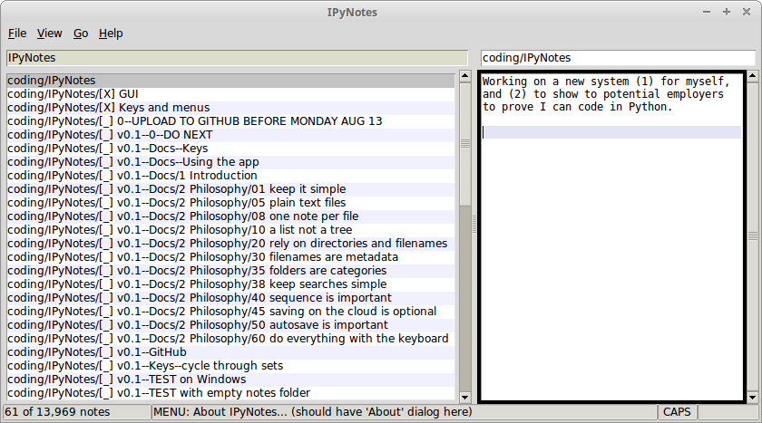

# IPyNotes

*Current version: v0.1.0.*

**IPyNotes** is a note organizer that I'm building in my spare time. It's a GUI application written in Python using Tkinter, and it's been tested on Linux and Windows (but not on OS X).

Currently it has no installer, so you'd download the archive file, extract its contents, navigate to the IPyNotes folder, and run `ipynotes.py`. From the shell in Linux, you can do this:

    git clone https://github.com/hhfernald/ipynotes.git
    cd ipynotes
    chmod +x ./ipynotes.py
    ./ipynotes.py

**2018-08-08:** This is a very early (alpha) release, with many features missing, such as proper undo, popup menus, syntax highlighting, setting of options, and other things I want to add. If you try this program out, expect bugs and make backups.

## Overview

IPyNotes expects to find notes in `$YOUR_HOME_FOLDER/IPyNotes/notes` on your hard drive. Currently there is no way to mirror the notes to the cloud from within the program.

Each note is a single plain-text file with an `.md` extension and encoded as UTF-8. Notes can be stored in the `notes` folder or in a subfolder; IPyNotes searches all subfolders for notes.

The main window has two panes. The left pane contains the filter bar along the top; the listbox that displays note paths takes up the rest of the pane. The right pane has the path bar along the top, and the text editor, for editing the contents of the current note, fills the rest of the pane.

The main window shows the notes, not with a tree widget, but with a plain listbox, as a relative path to the note, without the `.md` extension. So `~/IPyNotes/notes/coding/my editor.md` would appear in the list as `coding/my editor` (or as `coding\my editor` on Windows).

You use the filter bar to limit the notes displayed in the listbox. If you type `food lost "any kind"` into the filter bar, then the listbox displays only notes whose relative paths include all three of the terms "food", "lost", and "any kind" (in any order).

The path bar above the note editor is used to rename notes. Changing `my/first/note` to `another/name` renames `~/IPyNotes/notes/my/first/note.md` to `~/IPyNotes/notes/another/name.md`.

The note editor is a plain text widget, with no syntax highlighting yet.

You can access each of the four widgets with a keyboard shortcut:

- Alt-1 moves the focus to the filter bar.
- Alt-2 moves the focus to the listbox.
- Alt-3 moves the focus to the path bar.
- Alt-4 moves the focus to the text editor.

Moving among the notes in the listbox is easy. Ctrl-J displays the next note, and Ctrl-K displays the previous one.

Notes are automatically saved, so you don't have to keep remembering to hit Ctrl-S every time you make a change to a note (though Ctrl-S will force a save immediately).

## Dependencies

- Python 3.5+
- Tkinter and ttk (which usually come with Python)

## Free Open-Source Software

I wrote this application for no one but myself, but maybe its source code will be useful to someone else. I'm releasing IPyNotes under the MIT License. If you find anything useful in the code I've written, feel free to fork this project and build your own application.

